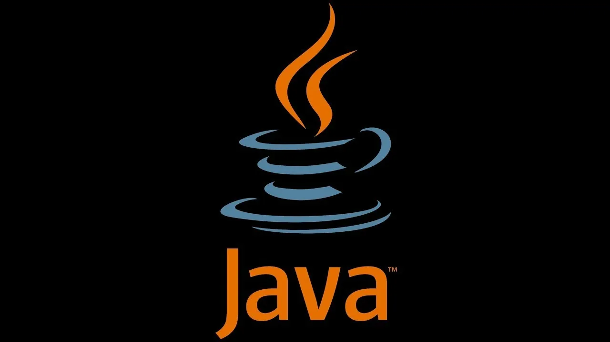

# Программа для игры в «Морской бой»

**Программа для игры в «Морской бой»** — это учебный проект, представляющий собой консольное приложение для игры против компьютера в односторонний морской бой. Программа позволяет игроку вводить координаты выстрелов на поле 10×10, отмечать попадания и промахи, а также автоматически проверяет условия победы.

## Цель проекта

Создать программу, реализующую односторонний морской бой с автоматической случайной расстановкой кораблей противника, используя двумерные массивы для представления игрового поля и коллекции `HashSet` для хранения координат клеток кораблей.

## Назначение

Приложение будет выполнять следующие функции:

* Случайная расстановка флота противника на поле 10×10 с проверкой касаний кораблей.
* Ввод координаты выстрела игроком в формате «БукваЦифра» (например, А5, К10).
* Отметка попадания символом `X` и промаха символом `.` на игровом поле.
* Проверка корректности введённых координат и повторных выстрелов по одной клетке.
* Подсчёт количества выстрелов, попаданий и точности стрельбы.
* Печать (вывод) игрового поля в читаемом виде.
* Определение победного условия — уничтожение всех 20 клеток флота.

## Технологии

Для реализации проекта планируется использовать следующий стек:

* **Язык программирования:** Java 21
* **Среда разработки:** IntelliJ IDEA
* **Библиотеки:** `java.util.Random`, `java.util.HashSet`, `java.util.Scanner` (стандартная библиотека JDK)

## Разработчики

* **Студент:** Тарабрин Кирилл
* **Группа:** 24МКН(б)ЦТ

## Планы по развитию

* Добавление режима двусторонней игры (игрок против игрока).
* Реализация «умного» алгоритма стрельбы компьютера (добивание раненых кораблей).
* Добавление цветного вывода поля в консоли (ANSI-escape).
* Создание графического интерфейса на JavaFX или Swing.
* Написание автотестов с использованием JUnit 5.
* Подключение CI через GitHub Actions (сборка Maven/Gradle).
